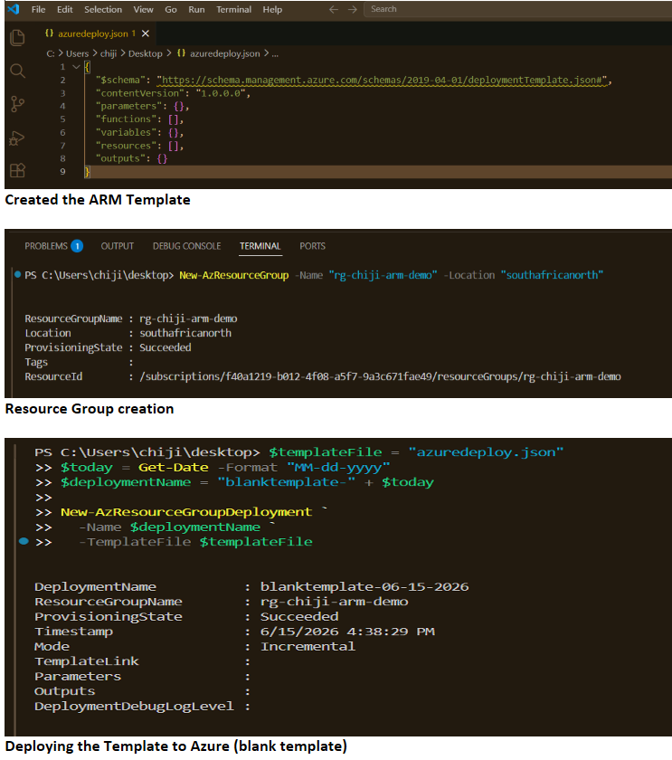
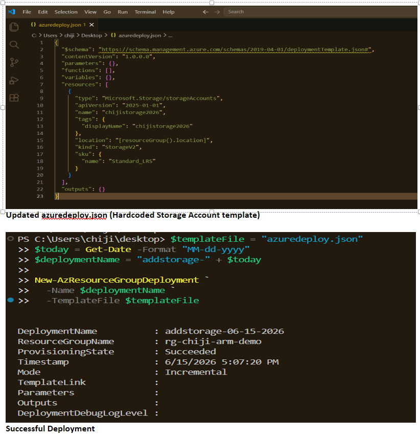
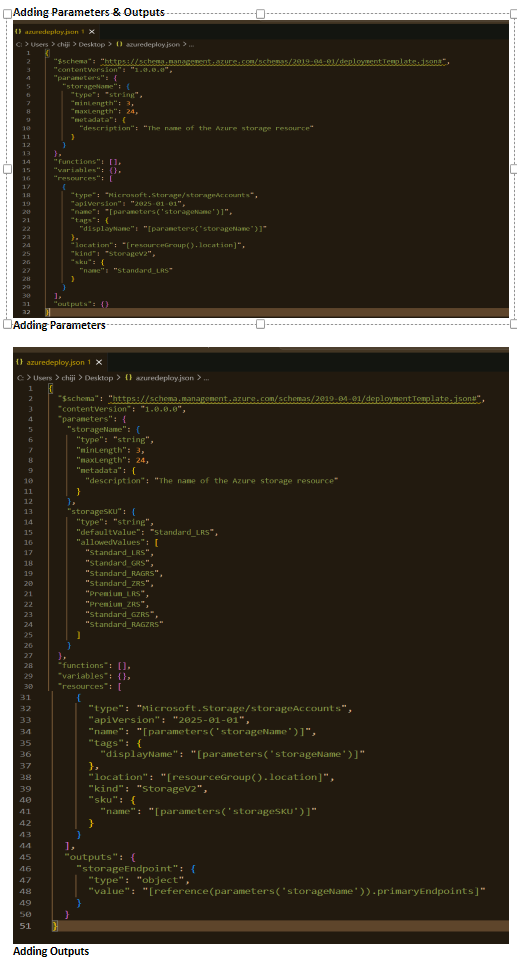
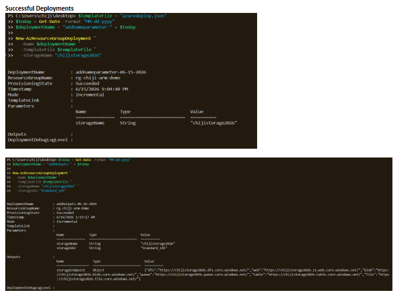
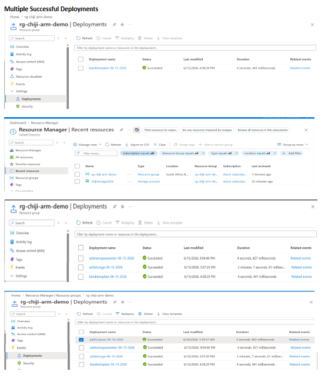

# Project 01 - Create and Deploy an Azure Resource Manager (ARM) Template

## Project Description
**Create and deploy an Azure Resource Manager template**, including parameters and outputs.

This project demonstrates building an ARM template from scratch, adding a real resource, making it reusable with parameters, implementing validation, and returning outputs.

## Resource Group
- **Name**: `rg-chiji-arm-demo`
- **Location**: `southafricanorth`

## Technologies Used
- Azure Resource Manager (ARM) Templates (JSON)
- Azure PowerShell
- Visual Studio Code
- Azure Portal

## Journey & Screenshots

  
**Starting Point** – Empty ARM template, Resource Group creation, and first blank deployment

  
**Adding Storage Account Resource** – Hardcoded version

  
**Adding Flexibility** – Parameters (`storageName`, `storageSKU` with validation) and Outputs

  
**Successful Deployment** – Showing parameters passed and outputs returned

  
**Multiple Successful Deployments** – Demonstrating idempotency in Azure Portal

## Key Learnings
- ARM template structure and syntax
- Using **Parameters** for reusability and environment flexibility
- Input validation with `allowedValues`, `minLength`, and `maxLength`
- Using the `reference()` function in **Outputs**
- Idempotent deployments (safe to run multiple times)
- Importance of Infrastructure as Code (IaC)

## Status
**✅ Completed**
